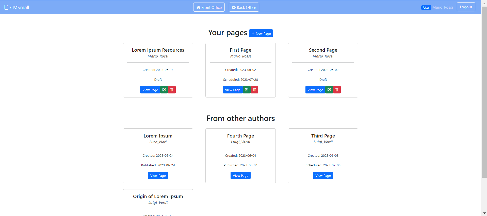
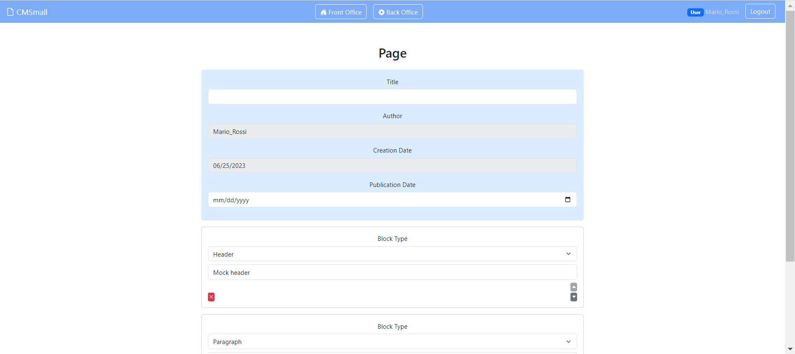

# CMSmall Web Application
## Student: s314971 OCCHIENA BEATRICE 




## React Client Application Routes

- Route `/`: home page of the application (i.e. the front office), displays all the published pages ordered by publication date. It receives the *pages* and *setPages* props.
- Route `/pages`: back office section of the application. It displays all the pages stored in the db, divided in two sections: "Your pages" and "From other authors". For admin only, it shows on the top a form to change the site name. It receives as props *pages*, *setPages*, *user*, *dirty*, *setDirty*, *siteName* and *setSiteName*.
- Route `/pages/:id`: dynamic route used to view a specific page. It displays the view page layout with its information and blocks, rendered in their final form.
- Route `/pages/edit/:id`: dynamic route used for editing a specific page. It displays the edit page layout with a form for its information and blocks, rendered in their editable form. All the fields are pre-compiled with the page information retrieved from the db. It receives as props *pages*, *setPages*, *user*, *dirty* and *setDirty*.
- Route `/pages/create`: used for creating a new page. It displays the create page layout with a form for its information and blocks, rendered in their editable form. It receives as props *pages*, *setPages*, *user*, *dirty* and *setDirty*.
- Route `/login`: login page. If the user is not logged in, it renders the login layout. If the user is already logged in, it automatically redirects to the /pages route. t receives as props the *handleLogin* function.


## API Server

### users API endpoints
##### POST `/api/sessions`
- Execute the log in of a user
- Request body: credentials of the user who is trying to login
``` JSON
{
    "username": "username",
    "password": "password"
}
```
- Response: `200 OK` (success)
- Response body: authenticated user
``` JSON
{
  "id": 1,
  "username": "user1@email.com",
  "name": "Mario_Rossi",
  "isAdmin": 0
}
```

##### GET `/api/sessions/current`
- Get logged-in user's info
- Request body: empty
- Response: `200 OK` (success)
- Response body: authenticated user
``` JSON
{
  "id": 1,
  "username": "user1@email.com",
  "name": "Mario_Rossi",
  "isAdmin": 0
}
```

##### DELETE `/api/sessions/current`
- Execute the log out of a user
- Request body: empty
- Response: `200 OK` (success)
- Response body: empty


##### GET `/api/users`
- If admin, get the name of all the users stored in the db
- Request body: empty
- Response: `200 OK` (success)
- Response body: arrays of strings
``` JSON
[
  "Luca_Neri",
  "Luigi_Verdi",
  "Mario_Rossi",
  "Teresa_Bianchi"
]
```

### pages API endpoints

##### GET `/api/pages`
- Get all the pages stored in the db
- Request body: empty
- Response: `200 OK` (success)
- Response body: array of pages
``` JSON
[
  {
    "id": 1,
    "title": "Page 1",
    "author": "Mario_Rossi",
    "creation_date": "2021-03-21T15:00:00.000Z",
    "publication_date": "2021-03-21T15:00:00.000Z",
    "blocks": "[{\"type\":\"header\",\"content\":\"Header 1\"},{\"type\":\"paragraph\",\"content\":\"Paragraph 1\"},{\"type\":\"image\",\"content\":\"image1.jpg\"}]"
  },
  {
    "id": 2,
    "title": "Page 2",
    "author": "Luigi_Verdi",
    "creation_date": "2021-03-21T15:00:00.000Z",
    "publication_date": "2021-03-21T15:00:00.000Z",
    "blocks": "[{\"type\":\"header\",\"content\":\"Header 2\"},{\"type\":\"paragraph\",\"content\":\"Paragraph 2\"},{\"type\":\"image\",\"content\":\"image2.jpg\"}]"
  },
  {
    "id": 3,
    "title": "Page 3",
    "author": "Teresa_Bianchi",
    "creation_date": "2021-03-21T15:00:00.000Z",
    "publication_date": "2021-03-21T15:00:00.000Z",
    "blocks": "[{\"type\":\"header\",\"content\":\"Header 3\"},{\"type\":\"paragraph\",\"content\":\"Paragraph 3\"},{\"type\":\"image\",\"content\":\"image3.jpg\"}]"
  }
]
```

##### GET `/api/pages/:id`
- Get a specific page stored in the db
- Request parameters: id of the page
- Request body: empty
- Response: `200 OK` (success)
- Response body: page
``` JSON
{
  "id": 1,
  "title": "Page 1",
  "author": "Mario_Rossi",
  "creation_date": "2021-03-21T15:00:00.000Z",
  "publication_date": "2021-03-21T15:00:00.000Z",
  "blocks": "[{\"type\":\"header\",\"content\":\"Header 1\"},{\"type\":\"paragraph\",\"content\":\"Paragraph 1\"},{\"type\":\"image\",\"content\":\"image1.jpg\"}]"
}
```

##### POST `/api/pages`
- Create a new page
- Request body: page to be created
``` JSON
{
  "title": "Page 4",
  "author": "Mario_Rossi",
  "creation_date": "2021-03-21T15:00:00.000Z",
  "publication_date": "2021-03-21T15:00:00.000Z",
  "blocks": "[{\"type\":\"header\",\"content\":\"Header 4\"},{\"type\":\"paragraph\",\"content\":\"Paragraph 4\"},{\"type\":\"image\",\"content\":\"image4.jpg\"}]"
}
```
- Response: `201 Created` (success)
- Response body: page created
``` JSON
{
  "id": 4,
  "title": "Page 4",
  "author": "Mario_Rossi",
  "creation_date": "2021-03-21T15:00:00.000Z",
  "publication_date": "2021-03-21T15:00:00.000Z",
  "blocks": "[{\"type\":\"header\",\"content\":\"Header 4\"},{\"type\":\"paragraph\",\"content\":\"Paragraph 4\"},{\"type\":\"image\",\"content\":\"image4.jpg\"}]"
}
```

##### PUT `/api/pages/:id`
- Update a specific page stored in the db
- Request parameters: id of the page
- Request body: page to be updated
``` JSON
{
  "title": "Page 4",
  "author": "Mario_Rossi",
  "creation_date": "2021-03-21T15:00:00.000Z",
  "publication_date": "2021-03-21T15:00:00.000Z",
  "blocks": "[{\"type\":\"header\",\"content\":\"Header 4\"},{\"type\":\"paragraph\",\"content\":\"Paragraph 4\"},{\"type\":\"image\",\"content\":\"image4.jpg\"}]"
}
```
- Response: `200 OK` (success)
- Response body: page updated
``` JSON
{
  "id": 4,
  "title": "Page 4",
  "author": "Mario_Rossi",
  "creation_date": "2021-03-21T15:00:00.000Z",
  "publication_date": "2021-03-21T15:00:00.000Z",
  "blocks": "[{\"type\":\"header\",\"content\":\"Header 4\"},{\"type\":\"paragraph\",\"content\":\"Paragraph 4\"},{\"type\":\"image\",\"content\":\"image4.jpg\"}]"
}
```

##### DELETE `/api/pages/:id`
- Delete a specific page stored in the db
- Request parameters: id of the page
- Request body: empty
- Response: `204 No Content` (success)
- Response body: empty

### website API endpoints

##### GET `/api/website/name`
- Get the name of the website
- Request body: empty
- Response: `200 OK` (success)
- Response body: name of the website
``` JSON
{
  "name": "CMSmall"
}
```

##### PUT `/api/website/name`
- Update the name of the website
- Request body: name of the website
``` JSON
{
  "name": "CMSmall"
}
```
- Response: `200 OK` (success)
- Response body: name of the website
``` JSON
{
  "name": "CMSmall"
}
```


## Database Tables

### Table pages
| name | type | schema |
|------|------|--------|
|**pages** |      |*CREATE TABLE "pages" ( "id" INTEGER NOT NULL, "title" TEXT NOT NULL, "author" TEXT NOT NULL, "creation_date" TEXT NOT NULL, "publication_date" TEXT, "blocks" TEXT, PRIMARY KEY("id") )* |
|id | INTEGER | "id" INTEGER NOT NULL
|title| TEXT |"title" TEXT NOT NULL|
|author| TEXT| "author" TEXT NOT NULL|
|creation_date |TEXT| "creation_date" TEXT NOT NULL|
|publication_date| TEXT| "publication_date" TEXT|
|blocks |TEXT |"blocks" TEXT|

- **author**: Must be one of the unique user names in the users table. When changed by an admin, this field is validated on the server side. I could have used the user id as a foreign key, but I chose this solution for the following reasons 
  - Faster Retrieval: By eliminating the need for an additional search operation within the users table when retrieving page data, I can significantly improve query execution times, especially when it comes to frequently retrieving and displaying page information.
  - Ensure data integrity: Storing the author's name in plain text ensures that even if a user is removed from the users table in the future, the page information will retain the original author's name.
  - Uniqueness of the user name: Since the value stored in the users table is unique, the authorship of the page can be verified simply by looking at the name of the currently logged in user.

- **blocks**: Contains an array in a JSON format. 
  { "blocks": [ { "type": "xxx" , "content": "xxx" } , ... ] }
  - Simplicity: Storing the blocks as an array simplifies the data model. Instead of creating separate tables or entities for each block type, I can use a single column to store the entire array. This streamlined approach reduces the complexity of the database schema and makes it easier to manage and query the page data. Especially when it comes to the order of the blocks, which is already implicit in the array itself.
  - Efficiency: Storing blocks as a JSON array reduces the number of database operations required to retrieve or update page content. The entire array can be retrieved or modified in a single database operation, improving overall efficiency and reducing the number of queries required to manipulate page content.


### Table users
| name | type | schema |
|------|------|--------|
|**users** | | *CREATE TABLE "users" ( "id" INTEGER NOT NULL, "email" TEXT NOT NULL UNIQUE, "name" TEXT NOT NULL UNIQUE, "hash" TEXT NOT NULL, "salt" TEXT NOT NULL, "is_admin" INTEGER NOT NULL DEFAULT 0, PRIMARY KEY("id") )*|
|id| INTEGER |"id" INTEGER NOT NULL|
|email |TEXT |"email" TEXT NOT NULL UNIQUE|
|name| TEXT| "name" TEXT NOT NULL UNIQUE|
|hash |TEXT |"hash" TEXT NOT NULL|
|salt| TEXT| "salt" TEXT NOT NULL|
|is_admin| INTEGER| "is_admin" INTEGER NOT NULL DEFAULT 0|

- Table for storing registered users and their information.

### Table website
| name | type | schema |
|------|------|--------|
|**website** ||CREATE TABLE "website" ( "name" TEXT NOT NULL )|
|name| TEXT| "name" TEXT NOT NULL|

- Table for storing the website name, which can be changed by the administrator, and possibly other settings in the future.


## Main React Components

### in Navigation.jsx
- `Navigation`: renders the nav bar at the very top of the page. It contains the name of the website and two personalized buttons called *FrontOfficeButton* and *BackOfficeButton*. If user is not logged in, the *LoginButton* is shown. Otherwise, a badge with the typer of user logged in (normal user or admin), their name and the *LogoutButton*.

### in Auth.jsx
- `LoginLayout`: sets the page layout for the login page. It renders the *LoginForm*.
- `LoginButton`: is a link to the login page.
- `LogoutButton`: triggers the user log out and then navigates to the home page.

### in PageLayouts.jsx
- `FrontOfficeLayout`: sets the page layout for the home page. It contains a title, a welcome message and a collection of *PageCard*.
- `BackOfficeLayout`: sets the page layout for the back office. It contains two sections for "Your pages" and "From other authors", both respectively showing a collection of *PageCard* and *PersonalPageCard*, and a button to add a new page. For admin only, it shows an extra top section with a form to change the name of the site.
- `ViewPageLayout`: sets the page layout for the page in read-only mode. It contains a *PageHeader* and a *Blocks* component.
- `EditPageLayout`: sets the page layout for the page in edit mode. It only renders a *PageForm* component.
- `CreatePageLayout`: sets the page layout for the page in creation mode. Similarly to the component above, it only renders a *PageForm* component.

### in Page.jsx
- `PageCard`: a card component showing the main information of each page (title, author, ...) and a button to access its *ViewPageLayout*. It is used to list each published page in the front office and each page from other authors in the back office.
- `PersonalPageCard`: a card component showing the main information of each page (title, author, ...) and three buttons, one to access its *ViewPageLayout*, one to access its *EditPageLayout* and one for deleting the page. It is used in the back office to list each page owned by the logged in user and for each page if the user is an admin.
- `PageHeader`: a card component that nicely displays all the information of a page in the view page layout.
- `PageForm`: a from component that allows the editing or the creation of a page. It contains several form group for the page info and it renders a *BlockForm* for each block already present in the page. At the bottom, there is a button to add a new *BlockForm* and other two buttons to submit or cancel the changes.

### in Blocks.jsx
- `Blocks`: used in the view page layout, it renders for each block of a page a different section based on the type of the block. For header blocks it displays a title (h5), for paragraph blocks a text (p) and for image blocks one of the four preloaded images.
- `BlockForm`: used in the *PageForm*, it renders a form component for each block of the page. Depending on the type of block, a different kind of *BlockContent* is shown. On the bottom, it contains all the buttons necessary to delete or change the order of the block.
- `BlockContent`: for header blocks it displays a text field, for paragraph block a wider text area field, and for image blocks a radio check selection in which each image is shown in a smaller size as the lable to be selected.

## Users Credentials


|email (used for authentication)|      name      | plain-text password |
|-----------------------|----------------|---------------------|
| user1@email.com       | Mario_Rossi    | password            |
| user2@email.com       | Luigi_Verdi    | password            |
| user3@email.com       | Teresa_Bianchi | password            |
| admin@email.com       | Luca_Neri      | password            |
